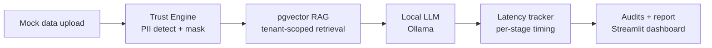

# Secure Enterprise AI Evaluation Sandbox

A self-hosted sandbox that lets bank and fintech compliance teams test an LLM workflow on their own mock data, fully offline, and walk away with an evidence-backed report on PII protection, tenant isolation, and latency.

> **Status:** 🚧 In active development. See the [Build Roadmap](#build-roadmap) for progress.

---

## The Problem

AI deals in regulated industries rarely stall on model quality. They stall in compliance review. Chief Compliance Officers and CISOs worry that sending customer data to an external API will leak proprietary data or violate privacy regulations such as GLBA, GDPR, and CCPA.

## The Solution

This sandbox runs entirely on the evaluator's own machine. It:

1. **Masks PII** (SSNs, card numbers, account numbers, names, emails) before any text reaches the model, the vector store, or the logs.
2. **Answers policy questions with local RAG**, retrieving from embedded policy documents in PostgreSQL + pgvector.
3. **Runs a local open-source LLM** through Ollama, so no data leaves the network.
4. **Measures everything**: per-stage latency (P50/P90/P95/P99), PII detector precision and recall, a canary-based leakage audit, and cross-tenant isolation tests.
5. **Produces a downloadable report** with methodology, so every number is reproducible.

## Architecture



| Layer | Technology | Role |
|---|---|---|
| Gateway | FastAPI (Python 3.11+) | Orchestrates scrub → retrieve → generate; times each stage |
| Trust Engine | Microsoft Presidio + custom recognizers | Detects and masks PII |
| Vector store | PostgreSQL 16 + pgvector | Embedded policy docs; row-level security for tenant isolation |
| Models | Ollama (`llama3.2:3b`, `nomic-embed-text`) | Local generation and local embeddings |
| Dashboard | Streamlit | Upload, live latency chart, results, report download |
| Packaging | Docker Compose | One-command start on an internal-only network |

## Repository Structure

```
.
├── docker-compose.yml
├── .env.example
├── CLAUDE.md                  # Context and rules for Claude Code
├── backend/
│   ├── Dockerfile
│   ├── requirements.txt
│   ├── app/
│   │   ├── main.py            # FastAPI app and routes
│   │   ├── config.py          # Settings from environment variables
│   │   ├── trust_engine/      # PII detection, custom recognizers, anonymizer
│   │   ├── rag/               # Ingestion, retrieval, LLM client
│   │   ├── metrics/           # Stage timers, percentile calculations
│   │   └── db/                # Schema, RLS policies, connection handling
│   └── tests/
├── dashboard/                 # Streamlit container: talks only to the gateway
│   ├── app.py                 # UI: upload, live latency chart, results, report
│   ├── batch.py               # Batch parsing and runner (also a CLI)
│   ├── reports.py             # Reads saved eval / detector / canary reports
│   ├── report_html.py         # Self-contained HTML report with methodology
│   └── tests/
├── data/
│   ├── policies/              # Mock bank policy documents
│   ├── sample_batches/        # Synthetic demo batches (CSV and JSONL)
│   └── generated/             # Synthetic test datasets (gitignored)
├── scripts/
│   ├── pull_models.sh         # Pre-pull Ollama models
│   ├── generate_dataset.py    # Faker-based labeled PII dataset
│   ├── eval_detector.py       # Precision / recall per entity
│   ├── canary_audit.py        # Leakage audit
│   └── isolation_test.py      # Cross-tenant adversarial queries
├── reports/                   # Generated reports (gitignored)
└── docs/
    ├── architecture.md
    ├── objection-handling.md
    ├── discovery-questions.md
    └── build-log.md
```

## Prerequisites

- Docker Desktop (or Docker Engine + Compose v2)
- 16 GB RAM recommended (8 GB minimum with a smaller model)
- ~10 GB free disk space for model weights
- Optional: NVIDIA GPU for faster generation
- Python 3.11+ for running scripts outside containers

## Quickstart

```bash
# 1. Clone and configure
git clone <your-repo-url> && cd <repo>
cp .env.example .env

# 2. Start the database and model server
docker compose up -d db ollama

# 3. Pull models (requires internet, one time only)
./scripts/pull_models.sh

# 4. Ingest mock policy documents
docker compose run --rm backend python -m app.rag.ingest

# 5. Start everything
docker compose up -d

# Dashboard: http://localhost:8501
# API docs:  http://localhost:8000/docs
```

### Dashboard

Open http://localhost:8501, upload a CSV (a `question` column) or JSONL
(`{"question": ...}` per line) batch (try `data/sample_batches/`), click
**Run batch** to watch per-stage latency live, review the saved RAG eval,
detector, and canary results under **Results**, and download a self-contained
HTML report with methodology under **Report**. Uploaded questions are never
saved; runs are stored in `reports/` as counts and timings only. The same batch
runs without the UI:
`docker compose run --rm dashboard python batch.py /data/sample_batches/policy_questions.jsonl`.

After step 3, the sandbox needs no internet access. To prove it, disconnect and run a full evaluation.

### Dev option: native Ollama on macOS

Docker on macOS can't use the Apple GPU, so the `ollama` container generates on CPU (tens of seconds per answer). For faster iteration you can run Ollama natively and point the backend at it. **All-Docker remains the default** and is what the offline demo uses. Results measured with native Ollama are labeled as such, and every report and latency sample records `model_backend` (`docker` or `native`) and the model names.

```bash
docker compose stop ollama                 # free port 11434
ollama serve                               # or open the Ollama app
./scripts/pull_models.sh --native          # native Ollama has its own model store
docker compose -f docker-compose.yml -f docker-compose.native-ollama.yml run --rm backend python -m app.rag.ingest
```

Host-side scripts (`.venv/bin/python scripts/...`) use `OLLAMA_BASE_URL=http://localhost:11434` and reach whichever Ollama holds that port, so set `MODEL_BACKEND=native` (or `docker`) for them; the URL alone can't tell the two apart. Re-ingest after switching so stored and query embeddings come from the same runtime.

## Build Roadmap

**Core**

- [x] **Task 1: Local infrastructure + RAG.** Compose with Postgres/pgvector and Ollama; ingest a mock policy PDF; answer questions offline.
- [x] **Task 2: Trust Engine.** Presidio with custom recognizers (routing numbers, IBAN, Luhn-validated cards, context-based account numbers); typed placeholders; scrub before embedding; no raw PII in logs.
- [x] **Task 4: Gateway + latency.** FastAPI `/query` endpoint; per-stage timers; samples stored in Postgres; percentile calculations.
- [x] **Task 6: Canary leakage audit.** Plant known fake PII; scan responses, logs, and vector table after each run.
- [x] **Task 7: Dashboard + report.** Streamlit upload, live latency chart, results panel, downloadable report with methodology.
- [ ] **Task 8: Packaging + air-gap proof.** Dockerfiles, `internal: true` network, one-command start.

**Stretch**

- [x] **Task 3: Detector evaluation (lean).** Labeled synthetic dataset; precision and recall per entity type.
- [ ] **Task 5: Multi-tenancy.** `tenant_id` with Postgres row-level security; adversarial cross-tenant tests.
- [ ] Reversible pseudonymization vault
- [ ] Fault injection mode (simulated 429 / 500)

## Results

*Filled in only from real, reproducible runs. Latency rows are labeled with their configuration: **native Ollama** = the macOS dev option (Apple GPU), not the all-Docker CPU setup. Details and per-entity tables in `docs/build-log.md`.*

| Metric | Result | How to reproduce |
|---|---|---|
| PII detector recall (overall) | 90.1% (precision 99.8%) on 1,000 synthetic records, rules-v2; per-entity table and before/after in `docs/build-log.md` | `python scripts/generate_dataset.py && python scripts/eval_detector.py` |
| Canary leakage | 43/207 synthetic canaries found (50 before the card-format fix), all in the masked question sent to the models (Trust Engine misses: bare digits without context, some names); 0 in answers, backend/db logs, native Ollama log, or database. (**native Ollama** run, n=200) | `python scripts/canary_audit.py --ollama-log ollama.log` |
| Cross-tenant retrievals | — | `python scripts/isolation_test.py` |
| Security layer latency (P95) | 92 ms PII scan (P50 34 ms, P99 203 ms), n=200, **native Ollama**, llama3.2:3b; 126 ms in an earlier run under heavier host load | `python scripts/canary_audit.py` |
| End-to-end latency (P95) | 3,341 ms (P50 1,600 ms), n=200, **native Ollama**, llama3.2:3b; 3,590 ms in an earlier run under heavier host load | `python scripts/canary_audit.py` |
| RAG answers / citations | 9/9 correct, 2/2 refusals, evidence cited 9/9 (11 questions, **native Ollama**, llama3.2:3b) | `MODEL_BACKEND=native python scripts/eval_rag.py` |

## Design Decisions

Short version (full reasoning in `docs/architecture.md`):

- **Local LLM** because the buyer's core concern is data leaving their control. The gateway is model-agnostic, so a private cloud endpoint can be swapped in.
- **pgvector** because banks already run and trust Postgres, and it keeps vectors, metadata, and access control in one system.
- **Presidio + custom recognizers** because regex alone can't catch unstructured identifiers.
- **Anonymize before embedding** because embeddings can carry information about their source text.
- **Row-level security** because isolation enforced by the database survives application bugs.
- **Canary audit** because you can't prove a negative, but you can check for known planted values everywhere data could land.

## Limitations

- This is an evaluation sandbox, not a production architecture.
- Local models are smaller and slower than frontier cloud models.
- PII detection is probabilistic; recall is measured and reported, not guaranteed.
- This tool supports compliance-relevant controls. It does not certify compliance with any regulation.

---

## Building with Claude Code

This repo includes a `CLAUDE.md` with project context and rules, which Claude Code reads automatically when started in the repo root. Open the folder in VS Code, start Claude Code, and work one task at a time.

### Kickoff prompts

Copy these one at a time. Finish and test each before moving on.

**Task 1**
```
Read CLAUDE.md and README.md. We're starting Task 1. First, explain the plan
and the concepts involved (pgvector, embeddings, chunking) before writing code.
Then create docker-compose.yml with Postgres (pgvector/pgvector:pg16) and Ollama
(with a volume for models), scripts/pull_models.sh, a mock bank policy document
in data/policies/, and backend/app/rag/ingest.py plus a query script. Use
nomic-embed-text through Ollama for embeddings. Tell me how to verify it works.
```

**Task 2**
```
Task 2: build the Trust Engine in backend/app/trust_engine/. Start with a
Presidio baseline, then add custom recognizers for US routing numbers, IBAN,
Luhn-validated card numbers, and account numbers detected by context words.
Replace detections with typed placeholders like [ACCOUNT_NUMBER_1]. Route
ingestion through it. Add pytest tests with realistic examples, including
tricky cases that should NOT be flagged. Explain how Presidio's context
scoring works.
```

**Task 4**
```
Task 4: wrap the pipeline in FastAPI with a POST /query endpoint. Time each
stage separately (pii_scan, retrieval, time_to_first_token, generation,
total) and store samples in a latency_samples table with a run_id. Add a
metrics module that computes avg, P50, P90, P95, P99 with numpy, and a
GET /metrics/{run_id} endpoint. Explain why percentiles need enough samples.
```

**Task 6**
```
Task 6: write scripts/canary_audit.py. Generate fake PII canaries, embed them
in a test batch, run the batch through the API, then search for every canary
value in API responses, application logs, the vector table, and any error
output. Report found vs. planted, with the location of any leak.
```

**Task 7**
```
Task 7: build the Streamlit dashboard in dashboard/app.py. Upload a CSV or
JSONL batch, send it to the API, show a live latency chart with a per-stage
breakdown, display audit results, and generate a downloadable HTML report
that includes a methodology section.
```

**Task 8**
```
Task 8: add Dockerfiles for backend and dashboard, put all services on a
Docker network with internal: true (keeping localhost ports reachable for
the dashboard), and update the Quickstart. Walk me through how to prove
nothing can reach the internet.
```

### Tips

- **Ask for explanations, not just code.** The goal is to understand this well enough to defend it in an interview.
- **Commit after every working step** so it's easy to roll back.
- **Log what broke** in `docs/build-log.md`. Those debugging stories are interview gold.
- **Read the diffs** before accepting them, and ask "why this approach?" when something isn't obvious.
