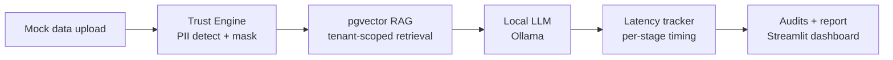
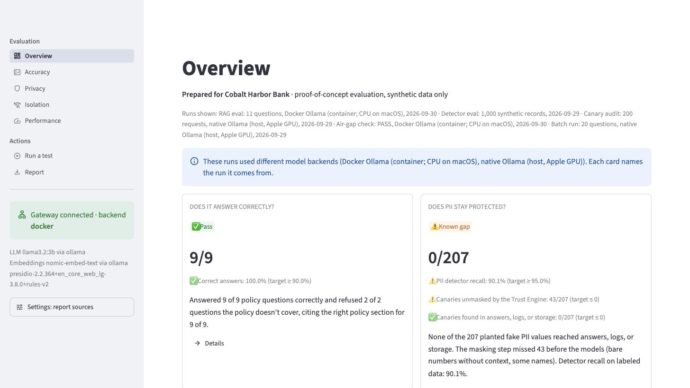
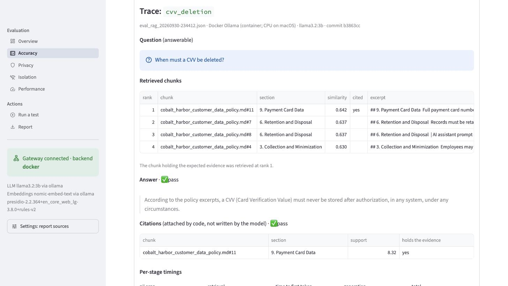
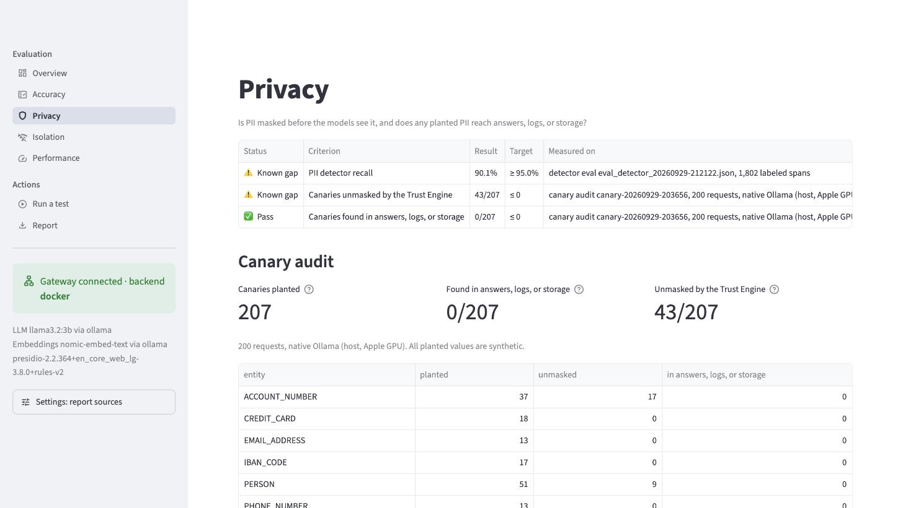
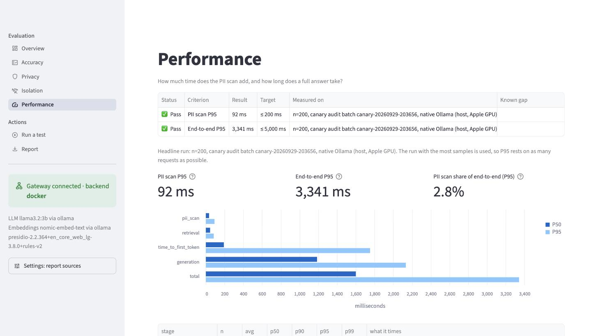
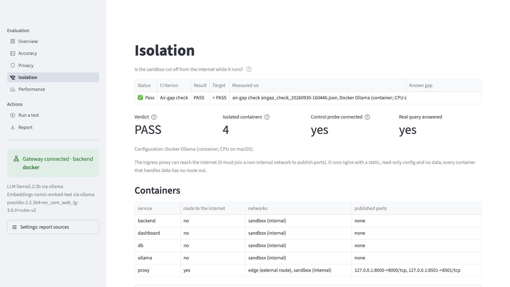

# Secure Enterprise AI Evaluation Sandbox

[](https://github.com/subritii/AI-Evaluation-Sandbox/actions/workflows/ci.yml)

A self-hosted sandbox that lets bank and fintech compliance teams test an LLM workflow on their own mock data, fully offline, and walk away with an evidence-backed report on PII protection, tenant isolation, and latency.

> **Status:** 🚧 In active development. See the [Build Roadmap](#build-roadmap) for progress.

---

## The Problem

AI deals in regulated industries rarely stall on model quality. They stall in compliance review. Chief Compliance Officers and CISOs worry that sending customer data to an external API will leak proprietary data or violate privacy regulations such as GLBA, GDPR, and CCPA.

## The Solution

This sandbox runs entirely on the evaluator's own machine. It:

1. **Masks PII** (SSNs, card numbers, account numbers, names, emails) before any text reaches the model, the vector store, or the logs.
2. **Answers policy questions with local RAG**, retrieving from embedded policy documents in PostgreSQL + pgvector.
3. **Runs a local open-source LLM** through Ollama, so no data leaves the network.
4. **Measures everything**: per-stage latency (P50/P90/P95/P99), PII detector precision and recall, a canary-based leakage audit, and cross-tenant isolation tests.
5. **Produces a downloadable report** with methodology, so every number is reproducible.

## Architecture



| Layer | Technology | Role |
|---|---|---|
| Gateway | FastAPI (Python 3.11+) | Orchestrates scrub → retrieve → generate; times each stage |
| Trust Engine | Microsoft Presidio + custom recognizers | Detects and masks PII |
| Vector store | PostgreSQL 16 + pgvector | Embedded policy docs; row-level security for tenant isolation |
| Models | Ollama (`llama3.2:3b`, `nomic-embed-text`) | Local generation and local embeddings |
| Dashboard | Streamlit | Upload, live latency chart, results, report download |
| Packaging | Docker Compose | One-command start on an internal-only network |

## Repository Structure

```
.
├── docker-compose.yml
├── .env.example
├── CLAUDE.md                  # Context and rules for Claude Code
├── backend/
│   ├── Dockerfile
│   ├── requirements.txt
│   ├── app/
│   │   ├── main.py            # FastAPI app and routes
│   │   ├── config.py          # Settings from environment variables
│   │   ├── trust_engine/      # PII detection, custom recognizers, anonymizer
│   │   ├── rag/               # Ingestion, retrieval, LLM client
│   │   ├── metrics/           # Stage timers, percentile calculations
│   │   └── db/                # Schema, RLS policies, connection handling
│   └── tests/
├── dashboard/                 # Streamlit container: talks only to the gateway
│   ├── app.py                 # UI: upload, live latency chart, results, report
│   ├── batch.py               # Batch parsing and runner (also a CLI)
│   ├── reports.py             # Reads saved eval / detector / canary reports
│   ├── report_html.py         # Self-contained HTML report with methodology
│   └── tests/
├── data/
│   ├── policies/              # Mock bank policy documents
│   ├── sample_batches/        # Synthetic demo batches (CSV and JSONL)
│   └── generated/             # Synthetic test datasets (gitignored)
├── scripts/
│   ├── pull_models.sh         # Pre-pull Ollama models
│   ├── generate_dataset.py    # Faker-based labeled PII dataset
│   ├── eval_detector.py       # Precision / recall per entity
│   ├── canary_audit.py        # Leakage audit
│   ├── airgap_check.py        # Proves the running stack has no route out
│   └── isolation_test.py      # Cross-tenant adversarial queries
├── proxy/nginx.conf           # Ingress proxy: the only way in from the host
├── reports/                   # Generated reports (gitignored)
└── docs/
    ├── architecture.md
    ├── objection-handling.md
    ├── discovery-questions.md
    └── build-log.md
```

## Prerequisites

- Docker Desktop (or Docker Engine + Compose v2)
- 16 GB RAM recommended (8 GB minimum with a smaller model)
- ~10 GB free disk space for model weights
- Optional: NVIDIA GPU for faster generation
- Python 3.11+ with a `.venv` for the host-side scripts (`airgap_check.py`, `canary_audit.py`, `eval_detector.py`)

## Quickstart

```bash
# 1. Clone and configure (set POSTGRES_PASSWORD)
git clone <your-repo-url> && cd <repo>
cp .env.example .env

# 2. Pull models (requires internet, one time only; runs in a separate setup container)
./scripts/pull_models.sh

# 3. Start everything: one command. Ingests the policies, then starts the gateway,
#    dashboard, and proxy on an isolated network.
docker compose up -d

# Dashboard: http://localhost:8501
# API docs:  http://localhost:8000/docs

# 4. Prove the running stack can't reach the internet (and still answers)
.venv/bin/python scripts/airgap_check.py
```

Hardware sizing, the configuration reference, and fixes for common problems
(disk space, Docker Desktop, iCloud and Spotlight, port conflicts, stale
`.env` files) are in [`docs/runbook.md`](docs/runbook.md).

### Network isolation

Every container that handles data (db, ollama, ingest, backend, dashboard,
tools) runs on an `internal: true` Docker network: no route out, no DNS for
outside names. Docker can't publish ports from an internal network, so one
nginx proxy joins it and an `edge` network and publishes only the dashboard
and API, on `127.0.0.1`. The proxy is the only container with a route out; it
holds no data and runs a static config, unprivileged, with a read-only
filesystem. The DB and Ollama have no host ports.

`scripts/airgap_check.py` tests this and saves a report the dashboard cites:
container networks and ports, egress probes (public IPs, DNS, the Ollama
registry) from inside containers and from the network, a **control** probe on
a normal network that must connect (otherwise the verdict is INCONCLUSIVE,
since "blocked" could mean the machine is offline), internal reachability,
ingress, the proxy's own route out (reported, not hidden), and a real query.

Scripts that need the DB or Ollama run inside the isolated network:

```bash
docker compose run --rm tools python scripts/eval_rag.py      # RAG eval
.venv/bin/python scripts/canary_audit.py                      # host: API via proxy, DB and logs via docker compose
.venv/bin/python scripts/eval_detector.py                     # host: needs no services
docker compose run --rm backend pytest                        # tests
```

### Dashboard

http://localhost:8501, organized by the questions a buyer asks:

| Page | Answers |
|---|---|
| **Overview** | One verdict per question (✅ pass, ⚠️ known gap, ❌ fail, ⏳ no data), each headline number against its target, and which runs are shown (size, backend, date) |
| **Accuracy** | Does it answer correctly? Per-question results; select a row for a trace (question, retrieved chunks with similarity, answer, citations, per-stage timings); before/after against the Task 1 baseline |
| **Privacy** | Is PII masked before the models, and does any reach answers, logs, or storage? Detector precision/recall and the canary audit |
| **Isolation** | Is it cut off from the internet? The air-gap check: containers, probes, control |
| **Performance** | How long does the PII scan add, and a full answer? P50/P95/P99 per stage, all latency runs |
| **Run a test** | Upload a CSV or JSONL batch and watch per-stage latency live; per-request traces stay in the browser session |
| **Report** | Download one self-contained HTML report with the criteria and methodology |

Targets live in [`dashboard/acceptance.toml`](dashboard/acceptance.toml). A
number that misses its target is a *known gap* only if the file names its
documented cause; otherwise it's a *fail*. Provenance (source file, commit,
backend, raw tables) is in the collapsed **Evidence** sections; which saved
run each page uses is under **Settings** in the sidebar. Uploaded questions
are never saved; saved runs hold counts and timings only. The same batch runs
without the UI:
`docker compose run --rm dashboard python batch.py /data/sample_batches/policy_questions.jsonl`.

### Screenshots

Taken from the running dashboard; every value shown comes from a saved run,
and all data is synthetic.

| | |
|---|---|
| **Overview:** verdict per buyer question against its target  | **Accuracy:** trace for one question  |
| **Privacy:** canaries unmasked vs found downstream  | **Performance:** headline run with P50/P95 per stage  |
| **Isolation:** air-gap check  | |

### Dev option: native Ollama on macOS

Docker on macOS can't use the Apple GPU, so the `ollama` container generates on CPU (7-45 s per answer in the all-Docker eval). For faster iteration you can run Ollama natively and point the backend at it. **All-Docker remains the default** and is what the offline demo and air-gap proof use. Every report and latency sample records `model_backend` (`docker` or `native`) and the model names.

**The native option is not network-isolated.** Containers on the internal network can't reach the host, so the override also puts backend, ingest, and tools on the `edge` network, which gives them a route out; `airgap_check.py` reports FAIL for it.

```bash
ollama serve                               # or open the Ollama app
./scripts/pull_models.sh --native          # native Ollama has its own model store
docker compose -f docker-compose.yml -f docker-compose.native-ollama.yml up -d   # re-ingests via native Ollama
```

Ingest runs on every start, so stored and query embeddings always come from the same runtime.

### Model providers: Ollama or any OpenAI-compatible endpoint

`LLM_PROVIDER` and `EMBED_PROVIDER` in `.env` pick `ollama` (default) or
`openai_compatible` for each model, with `OPENAI_BASE_URL` / `OPENAI_API_KEY`
for the endpoint (vLLM, llama.cpp, LM Studio, a private Azure OpenAI
deployment, or Ollama's own `/v1`). The Trust Engine masks the question before
either provider sees it, and the audits run unchanged. Every report and
latency sample records the provider and endpoint; the key is never recorded.
An endpoint on the sandbox network keeps the air-gap; one outside it needs
`docker-compose.external-endpoint.yml` and is reported as not isolated. See
[`docs/runbook.md`](docs/runbook.md#using-an-openai-compatible-endpoint).

### Continuous integration

[`.github/workflows/ci.yml`](.github/workflows/ci.yml) runs the backend and
dashboard test suites on every push and pull request (Python 3.11, Postgres +
pgvector as a service container). CI has no model server and no GPU:

| Tests | In CI |
|---|---|
| `backend/tests/test_ollama_live.py`: `test_embedding_model_returns_vectors_the_schema_accepts`, `test_llm_streams_a_short_answer` (marked `requires_ollama`) | **Skipped**: they call a real Ollama; they run locally whenever Ollama is reachable |
| Gateway API tests (`test_api.py`) | Run: with an empty database, a fixture ingests the real policy through the real Trust Engine using a fake embedder, then deletes those rows |
| Everything else (Trust Engine, ingest, metrics, grounding, model clients, dashboard) | Run: model calls are faked |

No test needs a GPU. The evaluation scripts (RAG eval, canary audit, air-gap
check) need the running stack and aren't part of CI.

## Build Roadmap

**Core**

- [x] **Task 1: Local infrastructure + RAG.** Compose with Postgres/pgvector and Ollama; ingest a mock policy PDF; answer questions offline.
- [x] **Task 2: Trust Engine.** Presidio with custom recognizers (routing numbers, IBAN, Luhn-validated cards, context-based account numbers); typed placeholders; scrub before embedding; no raw PII in logs.
- [x] **Task 4: Gateway + latency.** FastAPI `/query` endpoint; per-stage timers; samples stored in Postgres; percentile calculations.
- [x] **Task 6: Canary leakage audit.** Plant known fake PII; scan responses, logs, and vector table after each run.
- [x] **Task 7: Dashboard + report.** Streamlit upload, live latency chart, results panel, downloadable report with methodology.
- [x] **Task 8: Packaging + air-gap proof.** Dockerfiles, `internal: true` network, one-command start.
- [x] **Task 9: Model endpoint switch.** Ollama or any OpenAI-compatible endpoint, chosen in `.env`; Trust Engine and audits unchanged.
- [x] **Task 11: Runbook.** `docs/runbook.md`: hardware, install, config reference, known issues.
- [x] **Task 12: CI.** GitHub Actions runs the backend and dashboard tests on every push; tests that need Ollama are skipped and listed.

**Stretch**

- [x] **Task 3: Detector evaluation (lean).** Labeled synthetic dataset; precision and recall per entity type.
- [ ] **Task 5: Multi-tenancy.** `tenant_id` with Postgres row-level security; adversarial cross-tenant tests.
- [ ] **Task 10: Messy data ingestion.** A realistic messy PDF (tables, repeated headers/footers, multi-column layout); clean extraction; retrieval compared before and after.
- [ ] Reversible pseudonymization vault
- [ ] Fault injection mode (simulated 429 / 500)

## Results

*Filled in only from real, reproducible runs. Every latency number names its configuration and sample size: **native** = the macOS dev option (native Ollama, Apple GPU); **all-Docker** = the isolated default (Ollama container on CPU). Details and per-entity tables in `docs/build-log.md`.*

| Metric | Result | How to reproduce |
|---|---|---|
| Network isolation (all-Docker) | **PASS**: every data-handling container had no route out (public IPs, DNS, Ollama registry blocked) while a control probe on a normal network connected, and a real query was answered. The ingress proxy is the one container with a route out. The native-Ollama config correctly reports FAIL. | `python scripts/airgap_check.py` |
| PII detector recall (overall) | 90.1% (precision 99.8%) on 1,000 synthetic records, rules-v2; per-entity table and before/after in `docs/build-log.md` | `python scripts/generate_dataset.py && python scripts/eval_detector.py` |
| Canaries unmasked by the Trust Engine | 43/207 (native, 200 requests; 50 before the card-format fix); 6/21 (all-Docker, 20 requests). All are known gaps: bare digits without context, some names. | `python scripts/canary_audit.py` |
| Canaries found in answers, logs, or storage | 0/207 (native, including the native Ollama log); 0/21 (all-Docker, including the Ollama container log) | same run |
| Cross-tenant retrievals | — | `python scripts/isolation_test.py` |
| Security layer latency (PII scan P95) | 92 ms (native, n=200); 364 ms (all-Docker, n=20, host load 17-29) | `python scripts/canary_audit.py` |
| End-to-end latency (P95) | 3.3 s (native, n=200); 26.7 s (all-Docker, n=20) | `python scripts/canary_audit.py` |
| RAG answers / citations | 9/9 correct, 2/2 refusals, evidence cited 9/9 on native, all-Docker, and all-Docker through the OpenAI-compatible API (11 questions, llama3.2:3b) | `docker compose run --rm tools python scripts/eval_rag.py` |

## Design Decisions

Short version (full reasoning in `docs/architecture.md`):

- **Local LLM** because the buyer's core concern is data leaving their control. The gateway is model-agnostic, so a private cloud endpoint can be swapped in.
- **pgvector** because banks already run and trust Postgres, and it keeps vectors, metadata, and access control in one system.
- **Presidio + custom recognizers** because regex alone can't catch unstructured identifiers.
- **Anonymize before embedding** because embeddings can carry information about their source text.
- **Row-level security** because isolation enforced by the database survives application bugs.
- **Canary audit** because you can't prove a negative, but you can check for known planted values everywhere data could land.

## Limitations

- This is an evaluation sandbox, not a production architecture.
- Local models are smaller and slower than frontier cloud models.
- PII detection is probabilistic; recall is measured and reported, not guaranteed.
- This tool supports compliance-relevant controls. It does not certify compliance with any regulation.

---

## Building with Claude Code

This repo includes a `CLAUDE.md` with project context and rules, which Claude Code reads automatically when started in the repo root. Open the folder in VS Code, start Claude Code, and work one task at a time.

### Kickoff prompts

Copy these one at a time. Finish and test each before moving on.

**Task 1**
```
Read CLAUDE.md and README.md. We're starting Task 1. First, explain the plan
and the concepts involved (pgvector, embeddings, chunking) before writing code.
Then create docker-compose.yml with Postgres (pgvector/pgvector:pg16) and Ollama
(with a volume for models), scripts/pull_models.sh, a mock bank policy document
in data/policies/, and backend/app/rag/ingest.py plus a query script. Use
nomic-embed-text through Ollama for embeddings. Tell me how to verify it works.
```

**Task 2**
```
Task 2: build the Trust Engine in backend/app/trust_engine/. Start with a
Presidio baseline, then add custom recognizers for US routing numbers, IBAN,
Luhn-validated card numbers, and account numbers detected by context words.
Replace detections with typed placeholders like [ACCOUNT_NUMBER_1]. Route
ingestion through it. Add pytest tests with realistic examples, including
tricky cases that should NOT be flagged. Explain how Presidio's context
scoring works.
```

**Task 4**
```
Task 4: wrap the pipeline in FastAPI with a POST /query endpoint. Time each
stage separately (pii_scan, retrieval, time_to_first_token, generation,
total) and store samples in a latency_samples table with a run_id. Add a
metrics module that computes avg, P50, P90, P95, P99 with numpy, and a
GET /metrics/{run_id} endpoint. Explain why percentiles need enough samples.
```

**Task 6**
```
Task 6: write scripts/canary_audit.py. Generate fake PII canaries, embed them
in a test batch, run the batch through the API, then search for every canary
value in API responses, application logs, the vector table, and any error
output. Report found vs. planted, with the location of any leak.
```

**Task 7**
```
Task 7: build the Streamlit dashboard in dashboard/app.py. Upload a CSV or
JSONL batch, send it to the API, show a live latency chart with a per-stage
breakdown, display audit results, and generate a downloadable HTML report
that includes a methodology section.
```

**Task 8**
```
Task 8: add Dockerfiles for backend and dashboard, put all services on a
Docker network with internal: true (keeping localhost ports reachable for
the dashboard), and update the Quickstart. Walk me through how to prove
nothing can reach the internet.
```

### Tips

- **Ask for explanations, not just code.** The goal is to understand this well enough to defend it in an interview.
- **Commit after every working step** so it's easy to roll back.
- **Log what broke** in `docs/build-log.md`. Those debugging stories are interview gold.
- **Read the diffs** before accepting them, and ask "why this approach?" when something isn't obvious.
